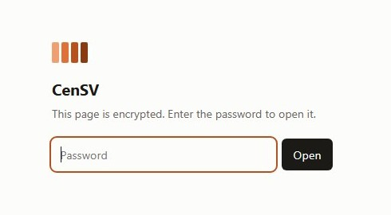

# CenSV

Interactive browser for centromeric structural variation.

**CenSV** presents structural variants called inside human centromeric α-satellite
higher-order repeat arrays, positioned on the **T2T-CHM13 v2.0** assembly, together with the
molecular and disease associations reported for each. It is the companion browser to a
manuscript in preparation from the [Weinstock Lab](https://github.com/weinstocklab) at Emory
University.

## Browser

**https://yikaidong-git.github.io/CenSV/**

The whole browser is one self-contained page — the catalog, the annotations, the stylesheet
and the application are encrypted into a single file and decrypted in your own browser. It
makes no network request after loading and stores nothing.

> **Access is restricted until publication.** The manuscript is unpublished, so the page opens
> with a password; please contact the authors for it. This repository is public *because* its
> contents are ciphertext — there is nothing readable here without that password, including
> the page's own text. When the manuscript appears, the browser will be republished open and
> the password retired.

Needs a current browser — Chrome 80, Firefox 113 or Safari 16.4 and newer — and an `https://`
address, because browsers expose the decryption API only in a secure context. A copy saved and
opened from a local folder will say so rather than fail silently.

## Contents

| | |
|---|---|
| `index.html` | the browser, encrypted with AES-256-GCM under a PBKDF2-HMAC-SHA256 key at 600,000 iterations |
| `docs/screenshot.jpg` | what a visitor without the password sees |
| `.nojekyll` | serves the file unprocessed through GitHub Pages |

Opening the page costs about a fifth of a second, once per browser tab.

The source, the data pipeline, the verification suite and the deployment live in a separate
private repository until publication, at which point they will be published alongside this.

## Cite

A citation will be added when the manuscript is published. Until then, please contact the
authors before referring to this resource.

## License

[MIT](LICENSE).
